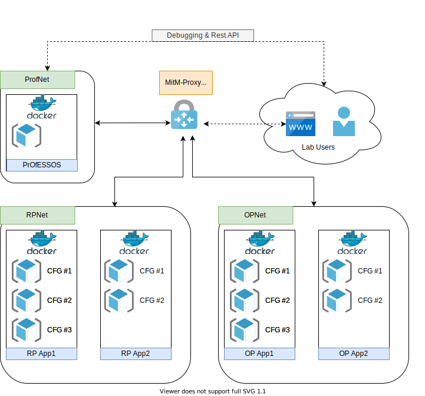

# oidc-docker-libs

## Minimum system requirements

- 4 CPU cores
- 8 GB RAM
- 24 GB of free space

## Build & Run

```
docker-compose build --build-arg GITHUB_TOKEN=${GITHUB_TOKEN}
docker-compose up
```

## Reset to default settings

OPs which uses SQL databases are configured without a persistent database.
Database is always recreated with a sql dump.
To reset the complete lab use:
```
docker-compose down
docker-compose up
```

## Use proxy

- Configure Browser to use Proxy -> http://localhost:8080
- (optional) Get generated CA oidc-ca.crt from docker volume certs (/var/lib/docker/volumes/oidc-docker-libs_certs/_data/oidc-ca.crt)
    and add it to your browser trust store to avoid self signed ca warning
- Sites could be reached without further host file manipulation e.g. https://openid.professos

## mitmproxy

Mitmproxy is configured to run in regular mode.
Web interface could be found at http://localhost:8081

## The Lab



Landing page (https://lab) can be reached after connection to the proxy.

[PrOfESSOS](https://github.com/RUB-NDS/PrOfESSOS) as our open source implementation for fully automated 
Evaluation-as-a-Service for SSO can is located at https://professos/

[OpenID Provider in OPNet](docs/OP.md)

[Relying Parties in RPNet](docs/RP.md)
 


